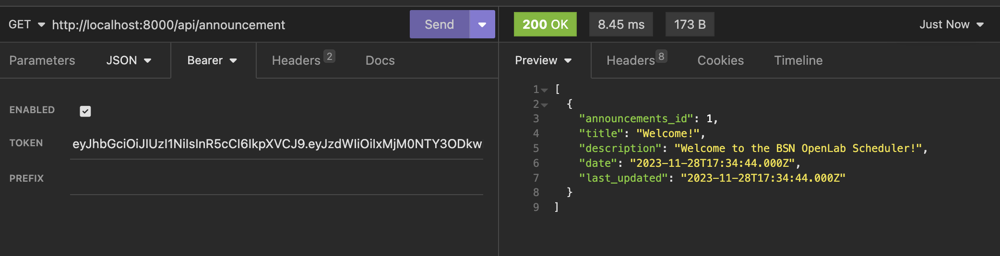
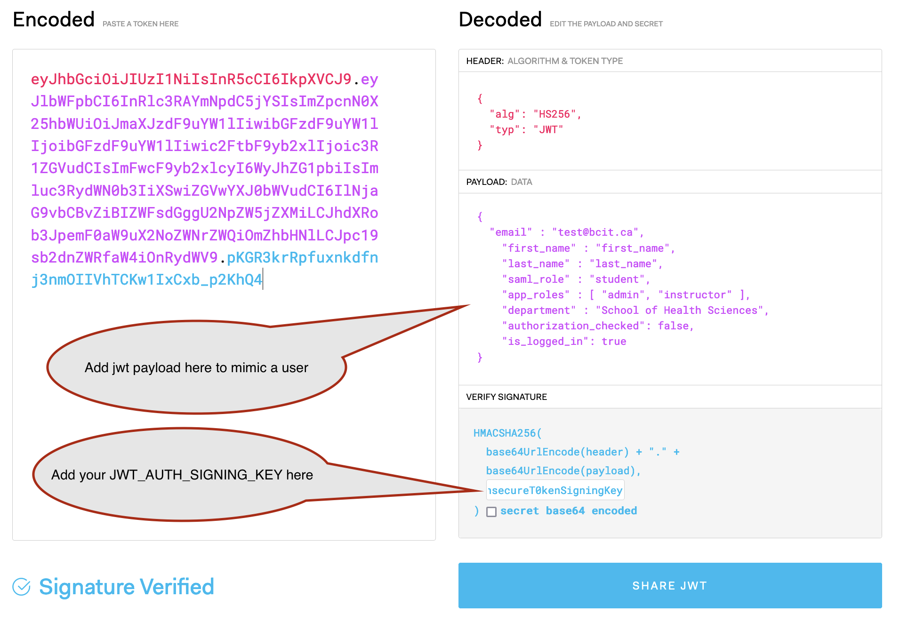

# OpenLab Scheduler Api

> This is the API and works as a backend for OpenLabs Scheduler WEB

OpenLab Scheduler is a web application designed to help BCIT's Nursing instructors communicate the calendar of the OpenLab to students. Students are also able to view announcements about the lab and take surveys that help instructors gain insights into students' learning.

## Required Technologies

- Node/Express
- Docker

## Running the Application

With Docker:

1. Ensure Docker is running on your local machine
1. In the root of the project, run `docker compose up`
1. This may take a long time, be patient

    - The database will be filled with one welcome announcement

1. Open `http://localhost:8000/api` to see the Rest endpoints

If you run into an error that says `"can't find file \r\n"`, go to the `docker-entrypoint.sh` file and change the End of Line sequence from `CRLF` to `LF` (in the bottom right)

## Making API calls with a JWT

> For example, making calls to `http://localhost:8000/api/announcement` using Postman/Insomnia...

Calls to `scheduler-api` require a `Bearer token` to be added to the request. To create the `Bearer token` you have to generate a JWT token. You can use any JWT tool, but a simple, standard one can be created on [`jwt.io`](https://jwt.io). The current JWT structure looks like the following:

```javascript
let jwtToken = jwt.sign({
 email,
 first_name,
 last_name,
 role,
 school,
 program,
 authorization_checked: true,
 is_logged_in: true,
}, process.env.JWT_AUTH_SIGNING_KEY);
```

> This structure might change to match or integrate with the BCIT SAML.



The JWT has to be signed with a `JWT_AUTH_SIGNING_KEY` which can be found in the `docker-compose.yml` file:



The resulting `Bearer token` needs to be added to each request.

*Also note: The JWT payload is where the user context is added (`Admin`, `Student`, `Instructor`).*


### Documentation

documentation can be found in the `documentation` folder after running `docker compose up`

documentation files will be served locally at localhost:9000/documentation
